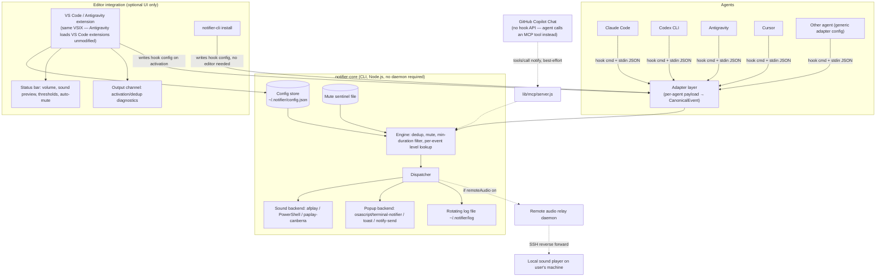

# Architecture

Clean-room design goal: reproduce every feature in [FEATURES.md](FEATURES.md), generalized so the notification core is agent-agnostic and editor-agnostic. See [AGENT_INTEGRATIONS.md](AGENT_INTEGRATIONS.md) for the per-agent hook facts this design is built on.

## Design principle: hooks are agent-owned, not editor-owned

Claude Code, Codex, Antigravity, and Cursor all fire hooks from their own config directories (`~/.claude`, `~/.codex`, `~/.gemini`/`.agents`, `.cursor`), regardless of which editor — or no editor — is driving them. That means **the notification core cannot live inside a VS Code extension's process**; it must be a standalone piece invoked by the hook command line itself. The editor extension is a thin, optional layer on top: install/settings UI, status bar, output channel. This single fact drives the whole component split below, and is why a plain terminal or Vim user gets full functionality with zero editor extension installed. GitHub Copilot Chat is the one exception with no hook mechanism at all — see its own section in [AGENT_INTEGRATIONS.md](AGENT_INTEGRATIONS.md#github-copilot-chat-vs-code-extension).

## Components



## Package layout (as built)

```
bin/notifier.js        # CLI entry point — the actual command every agent hook invokes
lib/core/               # CanonicalEvent handling, config load/merge, dedup+mute+threshold state, sound/popup backends, log
lib/adapters/           # claude.js, codex.js, antigravity.js, cursor.js, copilot.js, generic.js — each exports install()/uninstall()/normalize()
lib/mcp/                # server.js — the best-effort MCP `notify` tool GitHub Copilot Chat's agent mode can call (no hook API exists to install into)
lib/relay/              # remote-audio daemon + client (SSH reverse-forward case)
vscode-extension/       # packaged once, works in VS Code + Antigravity; UI-only, shells out to bin/notifier.js, never duplicates engine logic
```

Plain Node.js (no TypeScript build step, no npm-workspaces monorepo) — one package, imported directly by both the CLI and the extension. Simpler than the original multi-package sketch with no loss of the architectural separation (adapters still own all agent-specific knowledge; the engine still never sees raw agent JSON).

## Core engine responsibilities

All logic in [FEATURES.md §1](FEATURES.md) that isn't agent- or editor-specific lives here exactly once:

- **Per-event level lookup**: `sound+popup | sound | popup | off`, read from `~/.notifier/config.json` (mirrors `claudeNotifier.*` settings, editor-agnostic storage so CLI-only users get the same config surface as extension users).
- **Dedup**: an in-process-per-invocation engine can't hold state across hook calls, so dedup uses a small append-only state file (`~/.notifier/state.json`, keyed by `sessionId` + `kind`) with a short coalescing window (default 3s) — matches "rapid back-to-back events coalesce."
- **Min-duration threshold**: engine compares the incoming event's timestamp against the last `task_complete`-eligible event's start time for that session (tracked in the same state file).
- **Auto-mute when focused**: the engine alone can't know editor focus; the VS Code/Antigravity extension writes a live `focused: true/false` flag into the state file on `window.onDidChangeWindowState`, which the engine reads. CLI-only setups (no editor extension) simply never see this flag set, so auto-mute silently no-ops for them — correct default.
- **Subagent suppression**: `kind === 'subagent_complete'` and `kind === 'permission'`/`question` events tagged as subagent-originated (adapter sets a `fromSubagent` flag from the payload) are filtered per `suppressSubagentInteractions`.
- **Smart detection**: adapters (not the engine) detect Cursor/cmux/folderless-window conditions, since those require agent-specific payload inspection (e.g., Claude Code's `cwd` being empty, or a Cursor-specific env var) — see [AGENT_INTEGRATIONS.md](AGENT_INTEGRATIONS.md).
- **Project labeling**: `projectName` derived once in the adapter from `cwd`, passed through unchanged.

## Sound & popup backends

One small interface, three platform implementations, selected at runtime by `process.platform`:

```ts
interface SoundBackend { play(preset: string, volume: number): Promise<void> }
interface PopupBackend { show(title: string, body: string, opts: { clickable?: boolean }): Promise<void> }
```

- macOS: `afplay` for bundled/system sounds; `terminal-notifier` if installed (clickable), else `osascript -e 'display notification'`.
- Windows: PowerShell `[System.Media.SystemSounds]` for sound; popups use a WinRT toast (`ToastNotificationManager`, borrowing PowerShell's own registered AUMID — no BurntToast install needed), falling back to a detached `MessageBox` only if the WinRT API itself is unavailable. Both popup paths are spawned **detached**, not awaited to completion: the original implementation awaited `MessageBox.Show`, which blocks until a human clicks OK — every agent kills hook commands after a short timeout (as little as 5s), so that notification was reliably killed before it could ever be seen. This was the actual root cause of "nothing shows up on Windows," confirmed by reproducing it directly.
- Linux: `paplay`/`canberra-gtk-play` for XDG sounds (preset names map to real XDG sound-theme event IDs — an earlier version ignored the preset entirely and always played the same tone); `notify-send` for popups. Both inject `DISPLAY`/`DBUS_SESSION_BUS_ADDRESS`/`XDG_RUNTIME_DIR` defaults (keyed off the real uid) when a hook subprocess doesn't inherit them from a desktop session — a common, silent failure mode for processes spawned by a CLI agent rather than directly by an interactive login.
- Fallback: if a configured sound file is missing, both `SoundBackend`s fall back to a bundled WAV shipped in `resources/`.
- **Popup/sound processes are always spawned detached and unref'd**, never awaited to their own exit (except a short, bounded wait on Windows solely to detect an unsupported toast API and fall back) — a hook command that gets killed by the agent's own timeout must not be able to take the notification down with it.

## Remote / SSH case

Unchanged in spirit from the original: when the agent runs on a headless remote box, `notifier-cli` on the remote writes to a local Unix socket instead of calling the sound backend directly; `packages/relay` runs a tiny daemon on the **local** machine, reachable through an SSH reverse port-forward (`ssh -R`) the extension's "Set up remote audio…" command configures. The remote CLI's dispatcher detects the socket and routes there instead of trying (and failing) to play audio on a headless box.

## Editor integration layer

- **VS Code + Antigravity**: one extension package. Antigravity loads unmodified VS Code extensions, so no fork-specific build is needed — verified against Antigravity's own docs (extensions carry over from a VS Code/Cursor import, and the Marketplace VSIX installs directly). The extension's jobs: settings UI bound to `~/.notifier/config.json`, status bar, output channel, running the relevant adapter's `install()` on activation and on agent-selection change, writing the focus flag, and a first-run consent flow (see below) before anything is enabled.
- **Cursor**: has its own first-class adapter now (real hooks feature, not just the generic-adapter detection rule below) — see [AGENT_INTEGRATIONS.md#cursor](AGENT_INTEGRATIONS.md#cursor). The same VSIX's `install all` covers it.
- **GitHub Copilot Chat**: no editor-side hook exists to install at all (see [AGENT_INTEGRATIONS.md#github-copilot-chat-vs-code-extension](AGENT_INTEGRATIONS.md#github-copilot-chat-vs-code-extension)) — instead an explicit, separately-gated command registers an MCP `notify` tool. Never folded into the default `install all`, since it needs informed consent about its best-effort nature and touches the workspace's own `.vscode/mcp.json` (and optionally `.github/copilot-instructions.md`).
- **Other VS Code-family forks** (Windsurf, etc.): same VSIX works; the generic-adapter's smart-detection rule (from the original tool) is preserved so we don't fight another tool's own agent UI where no first-class adapter exists.
- **JetBrains / Zed / Neovim / bare terminal**: no bespoke plugin in v1. `notifier-cli install` registers the relevant agent hook config directly — this is sufficient because, per the design principle above, the editor was never in the data path. A thin JetBrains/Neovim plugin is a stretch goal only if users want the status-bar/UI affordances there too (tracked in [PROJECT_PLAN.md](PROJECT_PLAN.md), not required for parity with the original feature set).

### Critical gotcha: `process.execPath` inside the extension host is not a real Node binary

The command baked into every hook config (`~/.claude/settings.json`, `~/.codex/hooks.json`, `.agents/hooks.json`, `.cursor/hooks.json`) has to be resolvable **later, by the agent's own unrelated process**, not just by the extension that wrote it. When the CLI's `install` command runs as a child spawned by the VS Code/Antigravity extension host, `process.execPath` inside that child is the editor's own Electron helper binary (e.g. macOS's `Code Helper (Plugin)`), not a standalone `node` — it only behaves like Node because the extension host's own environment carries `ELECTRON_RUN_AS_NODE=1`. That variable does not survive into whatever separate process later reads the hook config and re-invokes the identical command string (the agent's own hook runner) — confirmed by reproducing it directly: stripped of that env var, the Electron helper crashes instantly (`Unable to find helper app`) and the hook never dispatches. `bin/notifier.js`'s `findRealNode()` fixes this by resolving to a real, absolute `node` path via `which`/`where` at install time (so the agent's own invocation-time `PATH` doesn't matter later), falling back to `process.execPath` only if no system Node can be found — `notifier doctor` / **Notifier: Run Doctor** surfaces which one got baked in. This is why Claude Code notifications could "just work" on one machine (when the Claude Code process happens to be a descendant of the editor's process tree) yet silently fail for Antigravity's separate backend engine, or for any agent invoked from a plain terminal.

## Config schema (superset of the original, agent-generalized)

```json
{
  "events": {
    "permission": { "level": "sound+popup", "sound": "Ping", "label": "🔐 Needs approval" },
    "question":   { "level": "sound+popup", "sound": "Glass", "label": "❓ Question" },
    "idle":       { "level": "popup",       "sound": "Pop",   "label": "💤 Idle" },
    "task_complete": { "level": "sound+popup", "sound": "Hero" },
    "subagent_complete": { "level": "off" }
  },
  "minTaskDurationThreshold": 0,
  "autoMuteWhenFocused": false,
  "suppressSubagentInteractions": true,
  "showChatTitle": true,
  "showDetail": true,
  "agents": { "claude": true, "codex": true, "antigravity": true, "cursor": true, "copilot": true },
  "remoteAudio": { "enabled": false }
}
```

This is the one file both the CLI and the extension read/write — no separate VS Code `settings.json` duplication, so CLI-only and extension users share identical behavior once configured.

## Why not a persistent daemon for the core engine

The original tool doesn't run a persistent background process either (aside from the opt-in remote-audio relay) — each hook invocation is a short-lived process reading/writing the shared state file. We keep that: it avoids a whole class of "daemon crashed/needs restart" bugs and matches how lightly agents expect hook commands to run (some enforce a `timeout` as low as 5s).
