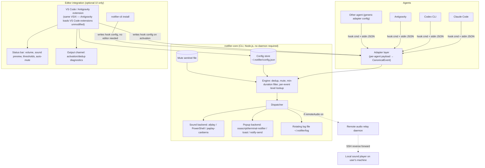

# Architecture

Clean-room design goal: reproduce every feature in [FEATURES.md](FEATURES.md), generalized so the notification core is agent-agnostic and editor-agnostic. See [AGENT_INTEGRATIONS.md](AGENT_INTEGRATIONS.md) for the per-agent hook facts this design is built on.

## Design principle: hooks are agent-owned, not editor-owned

Claude Code, Codex, and Antigravity all fire hooks from their own config directories (`~/.claude`, `~/.codex`, `~/.gemini`/`.agents`), regardless of which editor — or no editor — is driving them. That means **the notification core cannot live inside a VS Code extension's process**; it must be a standalone piece invoked by the hook command line itself. The editor extension is a thin, optional layer on top: install/settings UI, status bar, output channel. This single fact drives the whole component split below, and is why a plain terminal or Vim user gets full functionality with zero editor extension installed.

## Components



## Package layout (as built)

```
bin/notifier.js        # CLI entry point — the actual command every agent hook invokes
lib/core/               # CanonicalEvent handling, config load/merge, dedup+mute+threshold state, sound/popup backends, log
lib/adapters/           # claude.js, codex.js, antigravity.js, generic.js — each exports install()/uninstall()/normalize()
lib/relay/              # remote-audio daemon + client (SSH reverse-forward case)
vscode-extension/       # packaged once, works in VS Code + Antigravity; UI-only, shells out to bin/notifier.js, never duplicates engine logic
```

Plain Node.js (no TypeScript build step, no npm-workspaces monorepo) — one package, imported directly by both the CLI and the extension. Simpler than the original multi-package sketch with no loss of the architectural separation (adapters still own all agent-specific knowledge; the engine still never sees raw agent JSON).

## Core engine responsibilities

All logic in [FEATURES.md §1](FEATURES.md) that isn't agent- or editor-specific lives here exactly once:

- **Per-event level lookup**: `sound+popup | sound | popup | off`, read from `~/.notifier/config.json` (mirrors `claudeNotifier.*` settings, editor-agnostic storage so CLI-only users get the same config surface as extension users).
- **Dedup**: an in-process-per-invocation engine can't hold state across hook calls, so dedup uses a small append-only state file (`~/.notifier/state.json`, keyed by `sessionId` + `kind`) with a short coalescing window (default 3s) — matches "rapid back-to-back events coalesce."
- **Min-duration threshold**: engine compares the incoming event's timestamp against the last `task_complete`-eligible event's start time for that session (tracked in the same state file).
- **Auto-mute when focused**: the engine alone can't know editor focus; the VS Code/Antigravity extension writes a live `focused: true/false` flag into the state file on `window.onDidChangeWindowState`, which the engine reads. CLI-only setups (no editor extension) simply never see this flag set, so auto-mute silently no-ops for them — correct default.
- **Subagent suppression**: `kind === 'subagent_complete'` and `kind === 'permission'`/`question` events tagged as subagent-originated (adapter sets a `fromSubagent` flag from the payload) are filtered per `suppressSubagentInteractions`.
- **Smart detection**: adapters (not the engine) detect Cursor/cmux/folderless-window conditions, since those require agent-specific payload inspection (e.g., Claude Code's `cwd` being empty, or a Cursor-specific env var) — see [AGENT_INTEGRATIONS.md](AGENT_INTEGRATIONS.md).
- **Project labeling**: `projectName` derived once in the adapter from `cwd`, passed through unchanged.

## Sound & popup backends

One small interface, three platform implementations, selected at runtime by `process.platform`:

```ts
interface SoundBackend { play(preset: string, volume: number): Promise<void> }
interface PopupBackend { show(title: string, body: string, opts: { clickable?: boolean }): Promise<void> }
```

- macOS: `afplay` for bundled/system sounds; `terminal-notifier` if installed (clickable), else `osascript -e 'display notification'`.
- Windows: PowerShell `[System.Media.SoundPlayer]` for system sounds; Windows Toast via `BurntToast`-style PowerShell snippet or native `node-notifier`-equivalent toast call.
- Linux: `paplay`/`canberra-gtk-play` for XDG sounds; `notify-send` for popups.
- Fallback: if a configured sound file is missing, both `SoundBackend`s fall back to a bundled WAV shipped in `packages/core/assets/`.

## Remote / SSH case

Unchanged in spirit from the original: when the agent runs on a headless remote box, `notifier-cli` on the remote writes to a local Unix socket instead of calling the sound backend directly; `packages/relay` runs a tiny daemon on the **local** machine, reachable through an SSH reverse port-forward (`ssh -R`) the extension's "Set up remote audio…" command configures. The remote CLI's dispatcher detects the socket and routes there instead of trying (and failing) to play audio on a headless box.

## Editor integration layer

- **VS Code + Antigravity**: one extension package. Antigravity loads unmodified VS Code extensions, so no fork-specific build is needed — verified against Antigravity's own docs (extensions carry over from a VS Code/Cursor import, and the Marketplace VSIX installs directly). The extension's only jobs: settings UI bound to `~/.notifier/config.json`, status bar, output channel, running the relevant adapter's `install()` on activation and on agent-selection change, and writing the focus flag.
- **Other VS Code-family forks** (Cursor, Windsurf, etc.): same VSIX works; the generic-adapter's Cursor-detection rule (from the original tool) is preserved so we don't fight another tool's own agent UI.
- **JetBrains / Zed / Neovim / bare terminal**: no bespoke plugin in v1. `notifier-cli install` registers the relevant agent hook config directly — this is sufficient because, per the design principle above, the editor was never in the data path. A thin JetBrains/Neovim plugin is a stretch goal only if users want the status-bar/UI affordances there too (tracked in [PROJECT_PLAN.md](PROJECT_PLAN.md), not required for parity with the original feature set).

## Config schema (superset of the original, agent-generalized)

```json
{
  "events": {
    "permission": { "level": "sound+popup", "sound": "Ping", "label": "🔐 Needs approval" },
    "question":   { "level": "sound+popup", "sound": "Glass", "label": "❓ Question" },
    "idle":       { "level": "popup",       "sound": "Pop",   "label": "💤 Idle" },
    "task_complete": { "level": "sound+popup", "sound": "Hero" },
    "subagent_complete": { "level": "off" }
  },
  "minTaskDurationThreshold": 0,
  "autoMuteWhenFocused": false,
  "suppressSubagentInteractions": true,
  "showChatTitle": true,
  "showDetail": true,
  "agents": { "claude": true, "codex": true, "antigravity": true },
  "remoteAudio": { "enabled": false }
}
```

This is the one file both the CLI and the extension read/write — no separate VS Code `settings.json` duplication, so CLI-only and extension users share identical behavior once configured.

## Why not a persistent daemon for the core engine

The original tool doesn't run a persistent background process either (aside from the opt-in remote-audio relay) — each hook invocation is a short-lived process reading/writing the shared state file. We keep that: it avoids a whole class of "daemon crashed/needs restart" bugs and matches how lightly agents expect hook commands to run (some enforce a `timeout` as low as 5s).
