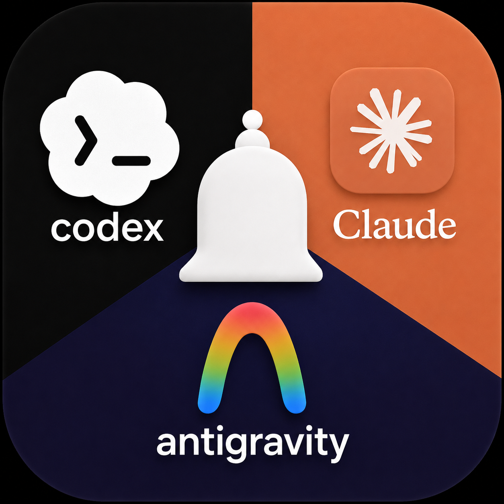

# ship-003-claude-codex-antigravity-notifier



Sound + popup notifications when Claude Code, Codex, Antigravity, or Cursor finish a task, need permission, or ask a question. Works from a bare terminal, VS Code, or Antigravity — see [ARCHITECTURE.md](ARCHITECTURE.md) for why the editor is optional. GitHub Copilot Chat gets a best-effort MCP `notify` tool instead of a real hook, since it has no lifecycle API — see [AGENT_INTEGRATIONS.md](AGENT_INTEGRATIONS.md#github-copilot-chat-vs-code-extension).

Docs: [FEATURES.md](FEATURES.md) (feature spec) · [ARCHITECTURE.md](ARCHITECTURE.md) · [AGENT_INTEGRATIONS.md](AGENT_INTEGRATIONS.md) (per-agent hook facts) · [PROJECT_PLAN.md](PROJECT_PLAN.md) (status) · [DEPLOYMENT.md](DEPLOYMENT.md) (marketplace publishing)

## Quickstart (CLI only, no editor extension needed)

```bash
npm install -g .          # or: npm link, from the repo root
notifier install all      # registers hooks for claude, codex, antigravity, and cursor
notifier install copilot  # separate, opt-in: registers the best-effort MCP notify tool for Copilot Chat
notifier doctor           # sanity-check what got installed, incl. which node binary hooks will invoke
notifier status           # see config + recent notification history
notifier mute / unmute    # global on/off switch
```

Per-repo overrides: drop a `.notifier.json` (same shape as `~/.notifier/config.json`) in a repo root.

**Every hook command needs a real, standalone Node.js reachable at install time** — `notifier doctor`'s `node binary hooks will invoke` line confirms this (see ARCHITECTURE.md's "Critical gotcha" section for why this matters more than it sounds).

## VS Code / Antigravity extension

```bash
cd vscode-extension
npm install -g @vscode/vsce
vsce package            # produces notifier-<version>.vsix
```

Install the `.vsix` in VS Code or Antigravity via **Extensions: Install from VSIX…** (`···` menu in the Extensions view) — same package works in both. On first activation it asks before enabling anything and fires a real test notification right then (this is also what gets Notifier to show up under your OS's own notification settings). It runs `notifier install all` on activation and adds a status bar entry, sound/volume/threshold pickers, mute/unmute commands, and a status/history view.

**Running a command**: press **`Ctrl+Shift+P`** (Windows/Linux) or **`Cmd+Shift+P`** (macOS) to open the Command Palette, type `Notifier`, and pick from the list — every command the extension contributes shows up there. Full command-by-command steps: [vscode-extension/README.md](vscode-extension/README.md#commands).

## Repo layout

```
bin/notifier.js        CLI entry point (also what agent hooks invoke)
lib/core/              engine, config, state/dedup, sound, popup, log, platformEnv
lib/adapters/          claude.js, codex.js, antigravity.js, cursor.js, copilot.js, generic.js
lib/mcp/               server.js — best-effort MCP notify tool for GitHub Copilot Chat
lib/relay/             remote-audio daemon + client (for headless SSH sessions)
vscode-extension/      thin UI layer — status bar, settings, commands
```
