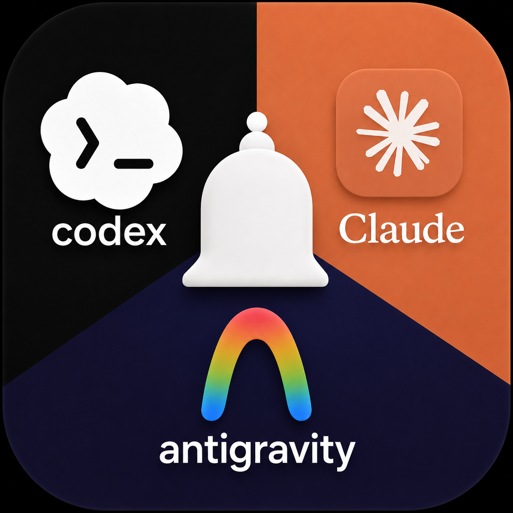

# Notifier — Claude, Codex & Antigravity

Sound + popup notifications when Claude Code, Codex, or Antigravity finish a task, need permission, or ask a question. Same package installs unmodified in VS Code and in Antigravity (a VS Code fork).

## Features

- Detects and hooks into **Claude Code**, **Codex CLI**, and **Antigravity** — one install covers all three.
- Sound + OS popup on task-complete, permission-needed, and question events.
- Per-event sound picker, volume control, and threshold tuning — no config file editing required.
- Status bar entry with mute / unmute / auto-mute-when-focused.
- Status & history view via the **Notifier: Show Status & History** command.
- Per-repo config overrides (`.notifier.json`) on top of global settings.

## How to run a command

All Notifier commands run through the **Command Palette**:

1. Press **`Ctrl+Shift+P`** (Windows/Linux) or **`Cmd+Shift+P`** (macOS). Works the same way in both VS Code and Antigravity.
2. Type **`Notifier`** — every command below appears in the filtered list.
3. Select the one you want and press **Enter**.

## Commands

| Command | What it does | Steps |
|---|---|---|
| `Notifier: Install Hooks (Claude, Codex, Antigravity)` | Registers hooks for all three agents | `Ctrl+Shift+P` → type `Notifier: Install Hooks` → Enter |
| `Notifier: Preview Sound…` | Plays a sound preset so you can audition it before assigning it | `Ctrl+Shift+P` → type `Notifier: Preview Sound` → Enter → pick a sound from the list |
| `Notifier: Choose Sound…` | Assigns a sound preset to a specific event (task complete, permission, question, idle, subagent done, error) | `Ctrl+Shift+P` → type `Notifier: Choose Sound` → Enter → pick the event → pick the sound |
| `Notifier: Set Volume` | Sets notification sound volume (0–100%) | `Ctrl+Shift+P` → type `Notifier: Set Volume` → Enter → type a percentage → Enter |
| `Notifier: Set Threshold` | Suppresses task-complete notifications for tasks shorter than N seconds | `Ctrl+Shift+P` → type `Notifier: Set Threshold` → Enter → type a number of seconds → Enter |
| `Notifier: Toggle Sound` | One-shot mute/unmute toggle | `Ctrl+Shift+P` → type `Notifier: Toggle Sound` → Enter |
| `Notifier: Mute` / `Notifier: Unmute` | Explicit global on/off switch | `Ctrl+Shift+P` → type `Notifier: Mute` (or `Unmute`) → Enter |
| `Notifier: Toggle Auto-mute When Focused` | Suppress notifications while this window is focused | `Ctrl+Shift+P` → type `Notifier: Toggle Auto-mute` → Enter |
| `Notifier: Set up remote audio (play sounds locally over SSH)…` | Routes notification sound to your local machine when the agent runs on a headless remote host | `Ctrl+Shift+P` → type `Notifier: Set up remote audio` → Enter → type the relay port → Enter → follow the two steps printed in the **Notifier** output channel |
| `Notifier: Install terminal-notifier (clickable macOS notifications)` | Installs `terminal-notifier` via Homebrew so macOS popups are clickable | `Ctrl+Shift+P` → type `Notifier: Install terminal-notifier` → Enter (opens a terminal running `brew install terminal-notifier`) |
| `Notifier: Open Settings` | Opens the Settings UI filtered to Notifier's options | `Ctrl+Shift+P` → type `Notifier: Open Settings` → Enter |
| `Notifier: Show Status & History` | Opens the output channel with current config + recent notifications | `Ctrl+Shift+P` → type `Notifier: Show Status & History` → Enter |

## Settings

Reachable via **`Notifier: Open Settings`**, or directly in `settings.json`:

- `notifier.autoMuteWhenFocused` (boolean, default `false`) — suppress sound + popups while this window is focused.
- `notifier.minTaskDurationThreshold` (number, default `0`) — suppress task-complete notifications for tasks shorter than this many seconds.
- `notifier.volume` (number, default `1`) — notification sound volume, 0 (silent) to 1 (full).

## Requirements

- Claude Code, Codex CLI, and/or Antigravity installed and used from this machine.
- Codex hooks require one manual trust step: run `codex` once in a terminal and accept "Trust all and continue".

## More

Full docs, architecture, and per-agent hook details: [github.com/pulaparthikamal/ship-003-claude-codex-antigravity-notifier](https://github.com/pulaparthikamal/ship-003-claude-codex-antigravity-notifier).
